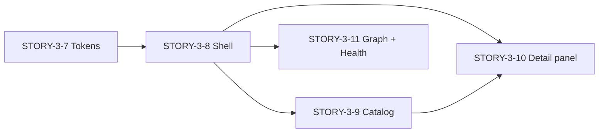

# Skill Lab UI — Design migration plan (R0.3)

**Status:** Planned  
**Source mockup:** `skill-set/mcp-server/web-js/` (`Skill Lab.html`, `styles-1..5.css`, `*.jsx`)  
**Target:** `skill-set/mcp-server/web/src/` (Vite + React 19 + TypeScript)  
**Requirements SSOT:** `spec/skill-lab-mcp-control-plane.md` (FR-039–042, US-001–011)  
**Architecture:** `docs/architecture.md` § Dashboard architecture (R0.3)

## Executive summary

R0.3 delivered a **functionally complete** read-only dashboard (`web/`): same HTTP contract as the mockup, presentation-only `lib/` helpers, React Router, React Flow graph. Claude Design produced a **visual and interaction overhaul** in `web-js` that preserves API shapes and user journeys but changes shell, tokens, and page UX.

**Migration is a presentation-layer project**, not a backend or API change. Keep `api/`, `context/`, and `lib/` largely unchanged; port markup, layout, and global CSS from the prototype.

## Dual-artifact model

| Artifact | Role | Migrate? |
|----------|------|----------|
| `web-js/Skill Lab.html` + `*.jsx` + `styles-*.css` | Design spec + interaction prototype | **From** (reference) |
| `web-js/*.tsx` (api, routes, components) | Stale copy of pre-redesign `web/src` | **Ignore** — use `web/src` as code SSOT |
| `web/src/` | Production TypeScript app | **To** (target) |

After migration, `web-js` remains an archived reference; do not ship it from `serve`.

## Architecture view (software-architecture)

### Layering (unchanged — FR-040)

```text
routes/*  →  api/*  →  HTTP /api/*  →  domain/
         ↘  lib/*     (presentation only)
```

**Allowed in React:** formatting, sort/filter UI state, client search on fetched lists, graph layout/selection, URL building, theme/density on `<html>`.

**Forbidden:** parsing `SKILL.md`, reading relationship JSON from disk, health rule evaluation, graph BFS in the browser.

### What ports unchanged

| Module | Notes |
|--------|--------|
| `api/client.ts`, `catalog.ts`, `graph.ts`, `health.ts` | RFC 9457 errors; same endpoints as `ui-api-compatibility.md` |
| `context/EnvironmentContext.tsx` | `?environmentId=` — extend for `?skill=` only |
| `lib/catalogView.ts`, `graphView.ts`, `healthView.ts`, `skillDetailView.ts`, `sourceLink.ts` | May gain small helpers (e.g. confidence bar width) — no domain logic |
| `components/SourceLink.tsx` | Restyle with `sl-*` classes |
| `components/SkillGraphCanvas.tsx` | **Keep React Flow** (see decision below) |
| Routes in `App.tsx` | Add query-param catalog detail; keep `/skills/...` for deep links |

### Structural changes

| Area | Today (`web/`) | Target (mockup) | Approach |
|------|----------------|-----------------|----------|
| **Shell** | Top header + horizontal nav | Left sidebar + top breadcrumb bar | New `Sidebar.tsx`, `TopBar.tsx`; rewrite `Layout.tsx` |
| **Environment** | `<select>` in header | Dropdown in sidebar + footer metadata | Restyle `EnvironmentSwitcher.tsx`; optional health pip + map version from API |
| **CSS** | Per-component `skill-lab-*` / page CSS | Global `sl-*` + CSS variables | Merge `styles-1..5.css` into `src/styles/` or phased imports |
| **Catalog detail** | Navigate to `/skills/...` | Side panel + `?skill=` | **ADR below** — dual pattern |
| **Graph canvas** | `@xyflow/react` | Hand-rolled SVG | **Restyle Flow** — do not swap layout engine in R0.3 |
| **Proposals** | Disabled nav + placeholder | Sketched R0.4 UI | Port **static sketch only**; keep non-functional until R0.4 |
| **Tweaks panel** | — | Theme/accent/density toggles | **Drop** — ship `data-theme="dark"` + sage accent default |

### Key decision: catalog skill detail (ADR)

**Context:** Mockup keeps catalog filter state via side panel; R0.3 spec says row click → skill detail route.

**Decision:** **Hybrid**

1. Catalog row click sets `?skill={environmentId}/{skillName}` and opens `<SkillDetailPanel mode="panel" />`.
2. `/skills/:environmentId/:skillName` remains for shareable URLs; renders same content `mode="fullscreen"`.
3. Extract shared `<SkillDetailContent>` from `SkillDetailPage.tsx` to avoid duplicate fetch/render logic.

**Traceability:** FR-039 (inspect skill), FR-041 (environment context preserved in URL), US-001 (catalog → detail flow).

### Key decision: graph implementation

**Options:**

| Option | Pros | Cons |
|--------|------|------|
| A. Restyle React Flow | Keeps STORY-3-4 filters, pagination, neighbor modes; less risk | Custom node components needed |
| B. Port SVG layout from `graph.jsx` | Matches mockup exactly | Duplicates layout logic; loses Flow ergonomics |

**Recommendation:** **Option A** for R0.3. Port inspector panel, high-risk aside, dotted background, and type-colored nodes via Flow `nodeTypes` + CSS tokens.

### File layout (target)

```text
web/src/
  styles/
    tokens.css          # :root + [data-theme="light"] from styles-1.css
    shell.css           # sidebar, nav, top bar (styles-1–2)
    primitives.css      # buttons, chips, tables (styles-2)
    catalog.css         # styles-3 (catalog + detail sections)
    graph.css           # styles-4 + Flow overrides
    health.css          # styles-5
  components/
    Layout.tsx
    Sidebar.tsx
    TopBar.tsx
    EnvironmentSwitcher.tsx
    SkillGraphCanvas.tsx
    SourceLink.tsx
    SkillDetailPanel.tsx      # new
    SkillDetailContent.tsx    # new — shared fetch/sections
  routes/                     # thinner — compose shared components
```

Import global styles once from `main.tsx`. Deprecate old `*.css` per route after each story lands.

### NFR / compatibility

- **oklch + color-mix:** Supported in current Chromium/Firefox/Safari; document fallback if enterprise browsers required.
- **NFR-003:** Token + shell change must not regress catalog render time; avoid loading all five CSS bundles synchronously in dev — concatenate for production build.
- **Accessibility:** Mockup uses contrast-safe oklch palette; verify focus rings on sidebar nav and expandable health rows (WCAG 2.2 AA target for text/UI components).
- **e2e-r03.test.ts:** Update file-presence checks if paths change; add optional visual smoke (manual) — no Playwright in R0.3.

## UX view (ux-designer)

### Product type and mood

**Internal developer portal** for personal/project Agent Skills — Backstage-adjacent governance, not consumer marketing.

| Attribute | Choice | Rationale |
|-----------|--------|-----------|
| Layout pattern | **Sidebar + workspace** | Persistent env + section nav; matches IDE/devtool mental model |
| UI style | **Dark-first minimal** with warm neutrals | Long sessions, reduces glare; sage accent = “healthy/growth” without fintech blue cliché |
| Typography | **Geist + Geist Mono** | Modern dev-tool readability; mono for paths/triggers |
| Motion | Subtle — expand/collapse health rows only; `prefers-reduced-motion` respected |

### Design tokens (codify in `tokens.css`)

| Token | Purpose |
|-------|---------|
| `--bg`, `--bg-1..3` | Surface hierarchy |
| `--fg`, `--fg-muted`, `--fg-dim`, `--fg-faint` | Text hierarchy |
| `--accent`, `--accent-dim`, `--accent-bg` | Primary actions, active nav |
| `--ok`, `--warn`, `--error`, `--info` + `*-bg` | Health severity semantic |
| `--radius-sm..lg`, `--shadow-1..2` | Cards, panels |
| `--sidebar-w`, `--header-h`, `--row-h` | Layout metrics |

Default: `<html data-theme="dark">`. Light theme via `[data-theme="light"]` — optional system toggle later (not tweaks panel).

### Flow traceability

| User journey | Mockup enhancement | Requirement |
|--------------|-------------------|-------------|
| Browse catalog | Stats strip → filter by health bucket | US-001, FR-039 |
| Inspect skill | Side panel preserves filters | US-001 |
| Open source file | SourceLink in panel + detail | FR-042, US-006 |
| Explore graph | Type-colored nodes, inspector, high-risk panel | US-007–010 |
| Run health scan | Summary cards filter findings; expandable rows | US-011, AC-005 |
| Switch environment | Sidebar dropdown | FR-041 |

### Out of scope (prototype only)

- Tweaks toolbar (multi-accent, density, catalog view modes) — pick **table-only** or **table + one alternate** if low cost; otherwise defer.
- Proposals interactions — static R0.4 sketch acceptable.
- ⌘K command palette — placeholder text only.

### UX validation checklist (post-migration)

- [ ] Catalog: search + filters + stats strip; row/panel does not clear filter state
- [ ] Detail: escalation callout visible; missing refs show exists/missing pills
- [ ] Graph: global/local modes, &gt;500 edge warning, high-risk sequences visible
- [ ] Health: scan → summary → filter → expand row shows recommendation
- [ ] Keyboard: sidebar nav focus order; Esc closes detail panel
- [ ] Contrast: primary text on `--bg` ≥ 4.5:1 (spot-check with DevTools)

## Migration sequence (vertical slices)

Aligned with `web-js/Changes and migration.md` and Linear issues **STORY-3-7 … STORY-3-11**.



| Story | Deliverable | PR strategy |
|-------|-------------|-------------|
| **STORY-3-7** | `tokens.css`, Geist fonts, `data-theme` on `<html>` | Small, visual reskin of existing pages |
| **STORY-3-8** | Sidebar, TopBar, env switcher in rail, health pip stub | Layout-only; routes unchanged |
| **STORY-3-9** | Catalog stats strip, `sl-table`, dashed filter chips | Same hooks; markup/CSS |
| **STORY-3-10** | `SkillDetailContent` + panel + `?skill=` | Biggest behavioral change |
| **STORY-3-11** | Flow node styling, health expandable UI, proposals sketch | Can split into 2 PRs if needed |

## Reference mapping (prototype → production)

| Prototype | Production target |
|-----------|-------------------|
| `styles-1.css` | `src/styles/tokens.css` + `shell.css` |
| `styles-2.css` | `src/styles/primitives.css` |
| `styles-3.css` | `src/styles/catalog.css` |
| `styles-4.css` | `src/styles/graph.css` |
| `styles-5.css` | `src/styles/health.css` |
| `app.jsx` Sidebar, TopBar | `Sidebar.tsx`, `TopBar.tsx`, `Layout.tsx` |
| `catalog.jsx` | `CatalogPage.tsx` |
| `detail.jsx` | `SkillDetailPanel.tsx` + `SkillDetailPage.tsx` |
| `graph.jsx` inspector layout | `GraphPage.tsx` layout only; keep `SkillGraphCanvas` |
| `health.jsx` | `HealthPage.tsx` |
| `data.js` | Delete dependency — live `api/*` |

## Risks and mitigations

| Risk | Mitigation |
|------|------------|
| Class name collision (`sl-*` global) | Remove old BEM per page as each story merges |
| Dual detail implementations diverge | Single `SkillDetailContent` component |
| React Flow styling fight | Scoped overrides under `.sl-graph-canvas` |
| R0.3 milestone marked done while UI lags | Track STORY-3-7–11 explicitly; exit criteria = functional **and** design parity |
| `web-js` confusion | README note: prototype only; link this doc |

## Post-migration cleanup

1. Archive or gitignore `web-js/Skill Labs.zip`; add `web-js/README.md` pointing to this plan.
2. Remove duplicate `web-js/skill-set/mcp-server/` docs tree.
3. Update `docs/architecture.md` shell section with sidebar diagram.
4. Optional screenshot refresh under `web-js/screenshots/` or `web/docs/`.
