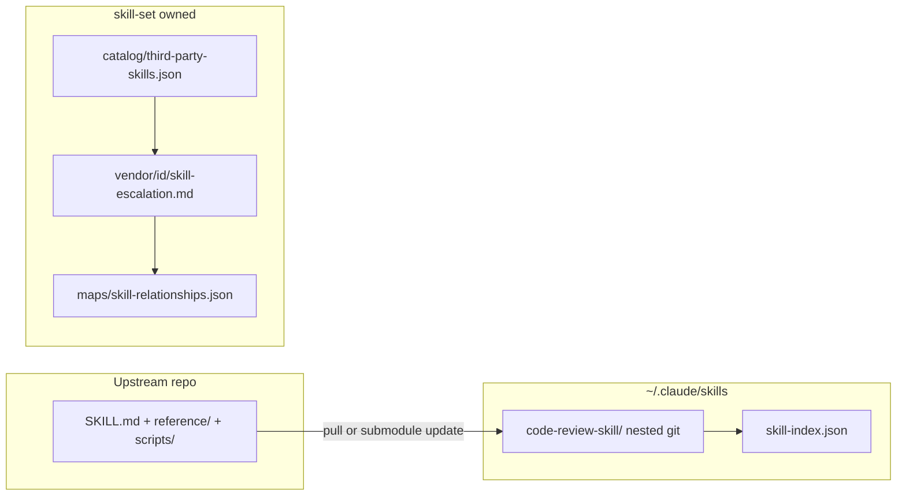

# Vendor (third-party) skills workflow

Integrate upstream skills from external Git repositories into the skill-set ecosystem **without** forking their layout, so `git pull` / submodule update stays frictionless.

## When to use

- User cloned or submodule-added a skill from another repo (e.g. `awesome-skills/code-review-skill`).
- User asks to “embed” a third-party skill in skill-set while keeping it updatable from upstream.
- Adding another vendor skill after the first (repeat § Install + § Embed).

## Architecture



| Layer | Location | Updated by |
|-------|----------|------------|
| Upstream body | `<folder>/` at skills root | `git pull` in folder or `git submodule update --remote` |
| Discovery | `<skills-root>/skill-index.json` | `scripts/update_skill_index.py` |
| Provenance | `catalog/third-party-skills.json` | Manual after sync |
| Ecosystem boundaries | `vendor/<folder>/skill-escalation.md` | Your `user-skills` repo (never upstream) |
| Agent handoff | `vendor/<folder>/integration.md` | Your `user-skills` repo |
| Graph edges | `maps/skill-relationships.json` | Curated; list sync via `update_relationship_map.py` |

**Do not** edit upstream files for embedding (no SKILL.md patches, no renaming `reference/` → `references/`) unless you maintain a fork. Conflicts on every pull otherwise.

## Install (choose one)

### A — Nested clone (current code-review-skill setup)

```powershell
cd $env:USERPROFILE\.claude\skills
git clone https://github.com/awesome-skills/code-review-skill.git code-review-skill
```

Parent repo (`user-skills`) should either:

- Track as **submodule** (recommended below), or
- Ignore the folder and document install in README (skill still works; parent CI won’t ship it).

### B — Git submodule (recommended for user-skills)

If the folder already exists as a nested clone:

```powershell
cd $env:USERPROFILE\.claude\skills
# backup, remove nested .git from parent’s view, re-add as submodule
git submodule add https://github.com/awesome-skills/code-review-skill.git code-review-skill
git submodule update --init --recursive
```

Commit the submodule pointer in `user-skills`. Updates: `git submodule update --remote code-review-skill`.

## Embed checklist

1. Add entry to `catalog/third-party-skills.json` (`folder`, `yaml_name`, `upstream`, `sidecar`, `last_synced_commit`).
2. Create `vendor/<folder>/skill-escalation.md` and `integration.md`.
3. Run from skills root:
   `python skill-set/scripts/update_skill_index.py -R`
4. Add `relationships[]` edges in `maps/skill-relationships.json` (evidence → sidecar).
5. Optional: `skill-set validate` with **lint_profile vendor** (skip Y4 name=folder, S3 README, S5 `reference/`).

## Lint profile: vendor

| Check | First-party | Vendor |
|-------|-------------|--------|
| Y4 name matches folder | Required | Waived if documented in `third-party-skills.json` |
| S3 no README.md | Warning | Waived (upstream ships README) |
| S5 only `references/` | Warning | Waived if upstream uses `reference/` |
| skill-escalation.md | Under skill `references/` | Under `skill-set/vendor/<folder>/` |

## Sync routine

After upstream update:

1. Pull or submodule update in `<folder>/`.
2. Set `last_synced_commit` in `third-party-skills.json`.
3. Re-run `update_skill_index.py` if frontmatter changed.
4. Re-read sidecar escalation; adjust edges only if boundaries changed.

## fork-management

Use **fork-management** only if you maintain a long-lived **fork** with local commits. For pristine upstream + sidecar, use this workflow instead.

## Related

- `catalog/README.md` — catalog schema
- `fork-management` — when the skill directory is your fork with `FORK.md`
- `references/canonicalize.md` — first-party skills only; not for vendor bodies
